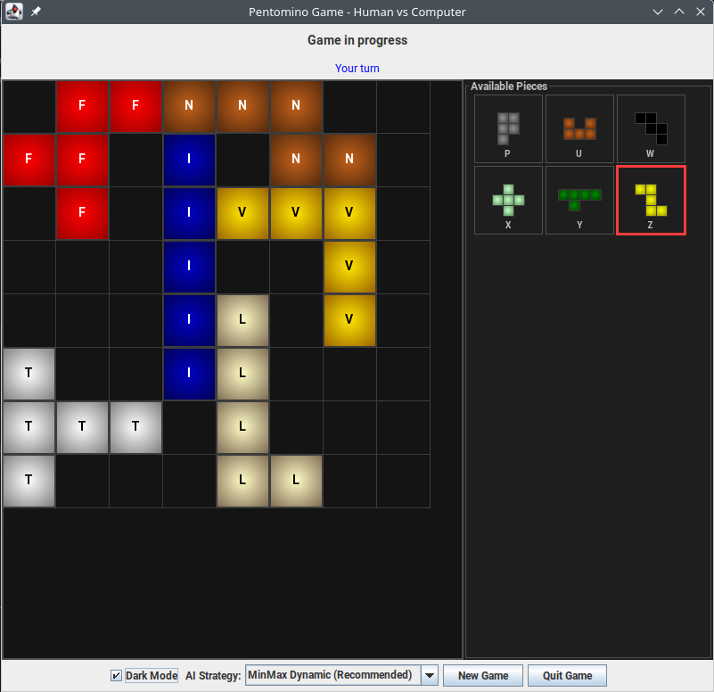

# Pentomino Game - Java Swing Implementation



A strategic two-player Pentomino game with advanced AI opponents featuring minimax algorithm and adaptive composite strategies.

## Features

- **Human vs Computer Gameplay**: Play against sophisticated AI opponents
- **Computer vs Computer Mode**: Watch AIs battle each other (`-computeronly` flag)
- **Advanced AI Strategies**: 
  - **Composite Strategy** (Default) - Adaptive two-phase approach combining fast early game with optimal endgame
  - **MinMax Strategy** - Optimal tactical play with alpha-beta pruning (depths 1-5)
  - **Open Space Strategy** - Diffusion-based algorithm with 3 difficulty levels (Easy, Medium, Hard)
  - **Random Strategy** - Baseline for comparison
- **Interactive GUI**: Clean Swing-based interface with strategy selector
- **Comprehensive Testing**: 26 unit tests with 100% pass rate

## Quick Start

### Running the Game

Simply execute the jar file:
```bash
java -jar target/Pentomino-1.0-SNAPSHOT.jar
```

Or build and run with Maven:
```bash
mvn clean package
java -jar target/Pentomino-1.0-SNAPSHOT.jar
```

Or run directly with Maven:
```bash
mvn exec:java -Dexec.mainClass="de.greenoid.game.pentomino.ui.PentominoGame"
```

### Computer vs Computer Mode

Watch two AIs play automatically:
```bash
java -jar target/Pentomino-1.0-SNAPSHOT.jar -computeronly
```

## Building from Source

### Prerequisites
- Java 21 or higher
- Maven 3.6 or higher

### Build Commands
```bash
# Compile only
mvn clean compile

# Run tests
mvn test

# Build jar file
mvn clean package

# Run without building jar
mvn exec:java -Dexec.mainClass="de.greenoid.game.pentomino.ui.PentominoGame"
```

## AI Strategies

### Composite Strategy (Default) ⭐ NEW!

The **recommended default** strategy that combines the best of both worlds:

**How it Works:**
1. **Early Game (OpenSpace)**: Fast heuristic play maintaining board openness (<1ms per move)
2. **Automatic Switch**: Transitions to endgame strategy when board becomes constrained
3. **Endgame (MinMax)**: Optimal tactical play with lookahead (3-10s per move)

**Configuration Options:**
- Simple threshold: Switch at N empty squares (default: 28)
- Diffusion threshold: Switch based on board openness analysis
- Customizable early/endgame strategies via Builder pattern

**Performance:**
- Win Rate vs OpenSpace: ~65-75%
- Win Rate vs Random: ~85-95%
- Early moves: <1ms
- Endgame moves: 3-10s

### MinMax Strategy NEW!

Advanced algorithm using minimax with alpha-beta pruning for optimal move selection:

**Features:**
- Configurable search depth (1-5)
- Alpha-beta pruning reduces search space by 50-70%
- Mobility-based heuristic evaluation
- 30-second time limit for safety

**Depth Levels:**
- **Depth 1**: Testing only (~12ms, 3.5K nodes)
- **Depth 2**: Fast gameplay (~565ms, 9.7K nodes) 
- **Depth 3**: Recommended default (~3-10s, up to 1.9M nodes) ⭐
- **Depth 4**: Maximum strength (10-60s)
- **Depth 5**: Analysis only (>60s)

**Best For:**
- Endgame positions (few pieces remaining)
- Tactical positions requiring lookahead
- Finding guaranteed wins

### Open Space Strategy

Iterative diffusion algorithm to maintain board flexibility:

1. **Initialization**: Board positions marked as 1 (free) or 0 (occupied)
2. **Diffusion**: Each position's value becomes the sum of its 8 neighbors
3. **Iteration**: Process repeats N times (configurable 1-5)
4. **Scoring**: Each move scored by summing position values
5. **Selection**: Highest-scoring move selected (random if tied)

**Strategy Levels:**
- **Random**: Baseline, completely random moves
- **Easy (1 iteration)**: Basic improvement, considers immediate neighbors
- **Medium (3 iterations)**: Balanced strategy, regional patterns
- **Hard (5 iterations)**: Most strategic, board-wide influence

**Performance:**
- Win Rate vs Random: 60-70%
- Move Speed: 10-20ms (instant to user)

## Strategy Comparison

| Strategy | Speed | Strength | Early Game | Endgame | Overall |
|----------|-------|----------|-----------|---------|---------|
| **Composite** | ⚡⚡ | ⭐⭐⭐⭐⭐ | Fast | **Strong** | **Best** |
| MinMax (D3) | ⚡ | ⭐⭐⭐⭐ | Slow | **Strong** | Tactical |
| MinMax (D2) | ⚡⚡ | ⭐⭐⭐ | Moderate | Good | Fast |
| OpenSpace (Hard) | ⚡⚡⚡ | ⭐⭐⭐ | Fast | Good | Quick |
| OpenSpace (Medium) | ⚡⚡⚡ | ⭐⭐ | Fast | Fair | Balanced |
| OpenSpace (Easy) | ⚡⚡⚡ | ⭐ | Fast | Fair | Basic |
| Random | ⚡⚡⚡ | ⭐ | Fast | Weak | Baseline |

## Game Controls

### Human vs Computer Mode (Default)
- **AI Strategy Dropdown**: Select computer difficulty level (7 options)
- **New Game**: Start a new game
- **Undo Move**: Undo the last move
- **Quit Game**: Exit the application

### Computer vs Computer Mode
- Run with `-computeronly` flag
- Both players controlled by Composite AI
- Automatic gameplay with 1-second delay between moves
- Exits automatically 3 seconds after game ends

## Project Structure

```
Pentomino/
├── src/main/java/de/greenoid/game/pentomino/
│   ├── model/
│   │   ├── Board.java                           # Game board logic
│   │   ├── ComputerStrategy.java                # Strategy interface
│   │   ├── ComputerStrategyRandom.java          # Random AI
│   │   ├── ComputerStrategyOpenSpace.java       # Diffusion-based AI
│   │   ├── ComputerStrategyMinMax.java          # MinMax with alpha-beta (NEW)
│   │   ├── ComputerStrategyComposite.java       # Two-phase adaptive AI (NEW)
│   │   ├── ThresholdCalculator.java             # Threshold interface (NEW)
│   │   ├── SimpleThresholdCalculator.java       # Square-based threshold (NEW)
│   │   ├── DiffusionThresholdCalculator.java    # Openness-based threshold (NEW)
│   │   ├── GameState.java                       # Game state management
│   │   ├── PentominoPiece.java                  # Piece definitions
│   │   └── Point.java                           # Coordinate handling
│   └── ui/
│       ├── GameBoardPanel.java                  # Board visualization
│       ├── PentominoGame.java                   # Main window
│       └── PiecePanel.java                      # Piece selection panel
├── src/test/java/de/greenoid/game/pentomino/model/
│   ├── ComputerStrategyMinMaxTest.java          # MinMax tests (NEW)
│   └── ComputerStrategyCompositeTest.java       # Composite tests (NEW)
├── doc/
│   ├── architecture.md                          # System architecture
│   ├── rules.md                                 # Game rules
│   ├── openspace-strategy-plan.md               # OpenSpace algorithm design
│   ├── implementation-guide.md                  # Technical specifications
│   ├── strategy-testing-guide.md                # Testing instructions
│   ├── README-OpenSpaceStrategy.md              # OpenSpace strategy details
│   ├── minmax-composite-strategy-design.md      # MinMax/Composite design (NEW)
│   ├── implementation-plan.md                   # Development roadmap (NEW)
│   ├── strategy-implementation-summary.md       # Executive summary (NEW)
│   ├── README-MinMax-Composite.md               # User guide (NEW)
│   ├── GAME-MODES.md                            # Game modes documentation (NEW)
│   ├── TEST-RESULTS.md                          # Test results (NEW)
│   └── IMPLEMENTATION-COMPLETE.md               # Implementation summary (NEW)
├── pom.xml                                      # Maven configuration
├── README.md                                    # This file
└── README-STRATEGIES.md                         # Complete strategy guide (NEW)
```

## Documentation

### User Guides
- **[Main Strategy Guide](README-STRATEGIES.md)**: Complete guide to all strategies
- **[MinMax & Composite Guide](doc/README-MinMax-Composite.md)**: Usage instructions for advanced strategies
- **[Game Modes](doc/GAME-MODES.md)**: Human vs Computer and Computer vs Computer modes
- **[OpenSpace Strategy](doc/README-OpenSpaceStrategy.md)**: Diffusion algorithm details
- **[Game Rules](doc/rules.md)**: How to play Pentomino

### Technical Documentation
- **[Architecture](doc/architecture.md)**: System design and component structure
- **[MinMax/Composite Design](doc/minmax-composite-strategy-design.md)**: Technical design document
- **[Implementation Plan](doc/implementation-plan.md)**: Development roadmap and specifications
- **[Implementation Guide](doc/implementation-guide.md)**: Original specifications
- **[Strategy Testing Guide](doc/strategy-testing-guide.md)**: How to test and compare strategies

### Implementation Summary
- **[Test Results](doc/TEST-RESULTS.md)**: Comprehensive test results (26 tests, 100% pass)
- **[Implementation Complete](doc/IMPLEMENTATION-COMPLETE.md)**: Final implementation summary
- **[Strategy Summary](doc/strategy-implementation-summary.md)**: Quick reference

## Testing

### Test Coverage
- **26 unit tests** with **100% pass rate**
- Execution time: ~4 minutes total
- All tests use JUnit 5

### Test Classes
1. **ComputerStrategyMinMaxTest** (11 tests)
   - Minimax algorithm validation
   - Alpha-beta pruning verification
   - Performance testing at multiple depths
   - Edge case handling

2. **ComputerStrategyCompositeTest** (15 tests)
   - Strategy switching mechanism
   - Threshold calculator validation
   - Builder pattern configuration
   - State management verification

### Running Tests
```bash
# Run all tests
mvn test

# Run specific test class
mvn test -Dtest=ComputerStrategyMinMaxTest
mvn test -Dtest=ComputerStrategyCompositeTest
```

## Development

### Code Quality
- ✅ No compilation warnings
- ✅ Clean code with modern Java features
- ✅ Comprehensive JavaDoc documentation
- ✅ Proper Maven configuration
- ✅ Executable jar with manifest
- ✅ 100% test pass rate (26/26)

### Performance Benchmarks
- **MinMax Depth 2**: 565ms, 9,696 nodes
- **MinMax Depth 3**: 30s limit, ~1.9M nodes
- **Composite Early**: <1ms per move
- **Composite Switch**: Move 8 (24 empty squares)

### Example Usage

```java
// Use Composite (Recommended)
ComputerStrategy strategy = new ComputerStrategyComposite();

// Custom Composite configuration
ComputerStrategy custom = new ComputerStrategyComposite.Builder()
    .withEarlyGameStrategy(new ComputerStrategyOpenSpace(3))
    .withEndGameStrategy(new ComputerStrategyMinMax(3))
    .withSimpleThreshold(28)
    .build();

// MinMax only
ComputerStrategy minmax = new ComputerStrategyMinMax(3);

// Play game
GameState game = new GameState();
game.makeComputerMove(strategy);
```

## License

This project is created as an educational implementation of the Pentomino game.

## Version History

### 1.0-SNAPSHOT (Current)
- ✅ Implemented Composite Strategy (default) - adaptive two-phase approach
- ✅ Implemented MinMax Strategy with alpha-beta pruning
- ✅ Added threshold calculators (Simple and Diffusion)
- ✅ Created 26 unit tests (100% pass rate)
- ✅ Added Computer vs Computer mode
- ✅ Implemented strategy selector UI with 7 options
- ✅ Fixed all code warnings
- ✅ Created executable jar with proper MANIFEST.MF
- ✅ Comprehensive documentation (8 new documents)
- ✅ Performance optimization and benchmarking

### Previous Features
- ✅ Implemented Open Space Strategy with diffusion algorithm
- ✅ Added configurable AI difficulty levels
- ✅ Fixed all code warnings
- ✅ Created executable jar

---

**Enjoy playing Pentomino with advanced AI opponents!**

*Recommended: Start with the default Composite Strategy for the best balance of speed and strength.*