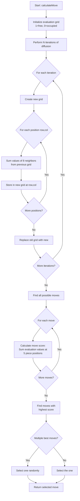

# Open Space Strategy Implementation Plan

## Overview
This document describes the design and implementation of a new computer strategy called **"Open Space Strategy"** that uses iterative diffusion to evaluate board positions based on their "openness" - how much free space surrounds them.

## Algorithm Description

### Core Concept
Instead of randomly selecting moves, this strategy evaluates each position on the board based on how much "open space" is around it through an iterative diffusion process.

### Diffusion Algorithm Steps

1. **Initialize Evaluation Grid**
   - Create an 8x8 integer grid matching the board
   - Set each position to `1` if unoccupied, `0` if occupied

2. **Iterative Diffusion** (repeat N times)
   - For each position (row, col):
     - Sum the values of all 8 adjacent positions (including diagonals)
     - Store in new grid
   - Replace old grid with new grid

3. **Result**
   - After N iterations, each position has a value representing its "openness"
   - Positions near large open areas have higher values
   - Positions near occupied areas or edges have lower values

### Move Evaluation

For each possible move:
1. Identify the 5 board positions the piece would occupy
2. Sum the diffusion values at those 5 positions
3. This sum is the move's score

Select the move with the highest score (random selection if tied).

## Implementation Details

### Class Structure

```java
public class ComputerStrategyOpenSpace implements ComputerStrategy {
    private final int diffusionIterations;
    private final Random random = new Random();
    
    // Constructor allows configuring diffusion depth
    public ComputerStrategyOpenSpace(int diffusionIterations)
    
    // Main strategy method
    public ComputerMove calculateMove(GameState gameState)
    
    // Performs iterative diffusion on board
    private int[][] evaluateBoardOpenness(Board board)
    
    // Calculates score for a specific move
    private int scorePossibleMove(ComputerMove move, int[][] evaluation)
    
    // Finds all valid moves (reuse logic from Random strategy)
    private List<ComputerMove> findAllPossibleMoves(GameState gameState)
    
    // Gets all transformations (reuse from Random strategy)
    private List<PentominoPiece> getAllTransformations(PentominoPiece piece)
}
```

### Diffusion Algorithm Details

```
Initial state (1 = free, 0 = occupied):
[1 1 1 1 1 1 1 1]
[1 1 1 1 1 1 1 1]
[1 1 0 0 1 1 1 1]
[1 1 0 0 1 1 1 1]
[1 1 1 1 1 1 1 1]
[1 1 1 1 1 1 1 1]
[1 1 1 1 1 1 1 1]
[1 1 1 1 1 1 1 1]

After 1 iteration (each cell = sum of 8 neighbors):
[3 5 5 5 5 5 5 3]
[5 8 6 6 8 8 8 5]
[5 6 3 3 6 8 8 5]
[5 6 3 3 6 8 8 5]
[5 8 6 6 8 8 8 5]
[5 8 8 8 8 8 8 5]
[5 8 8 8 8 8 8 5]
[3 5 5 5 5 5 5 3]

After 2 iterations:
[Values continue to increase in open areas]
[Values near occupied cells remain lower]
```

### Neighbor Calculation

For position (row, col), check all 8 directions:
```
(-1,-1) (-1,0) (-1,+1)
( 0,-1) (r,c)  ( 0,+1)
(+1,-1) (+1,0) (+1,+1)
```

Handle edge cases:
- Positions outside board boundaries contribute 0
- Occupied positions contribute 0

## Algorithm Visualization



## Strategy Configuration

### Diffusion Depth Parameter
- **Low (1-2 iterations)**: Focuses on immediate neighbors
  - Fast computation
  - Prefers positions next to existing open space
  
- **Medium (3-5 iterations)**: Balances local and regional openness
  - Moderate computation
  - Good general-purpose setting
  
- **High (6+ iterations)**: Considers broader board patterns
  - Slower computation
  - May over-prioritize center positions

**Recommended**: Start with 3 iterations

## Implementation Tasks

1. **Create ComputerStrategyOpenSpace class**
   - Implement ComputerStrategy interface
   - Add constructor with diffusion iterations parameter
   - Implement getStrategyName() method

2. **Implement evaluateBoardOpenness()**
   - Create initial evaluation grid from board state
   - Implement iterative diffusion loop
   - Handle boundary conditions

3. **Implement move scoring**
   - Calculate score for each possible move
   - Track best score(s)
   - Handle ties with random selection

4. **Reuse helper methods**
   - Copy findAllPossibleMoves() from ComputerStrategyRandom
   - Copy getAllTransformations() from ComputerStrategyRandom

5. **Integration**
   - Keep ComputerStrategyRandom for comparison
   - Update game configuration to allow strategy selection
   - Test both strategies side-by-side

## Expected Benefits

1. **Better Space Management**: Avoids creating isolated pockets
2. **Strategic Positioning**: Keeps maximum future options open
3. **Reduced Blocking**: Less likely to get stuck with no valid moves
4. **Configurable Difficulty**: Adjust iterations for different AI strengths

## Testing Strategy

1. **Unit Tests**: Test diffusion algorithm with known board states
2. **Integration Tests**: Verify move selection works correctly
3. **Performance Tests**: Compare win rates vs random strategy
4. **Parameter Tuning**: Test different iteration counts (1-5)

## Future Enhancements

- **Dynamic Iteration Count**: Adjust based on board fill level
- **Weighted Scoring**: Consider piece shapes when scoring
- **Opponent Modeling**: Predict and counter opponent moves
- **Minimax Search**: Look ahead multiple moves